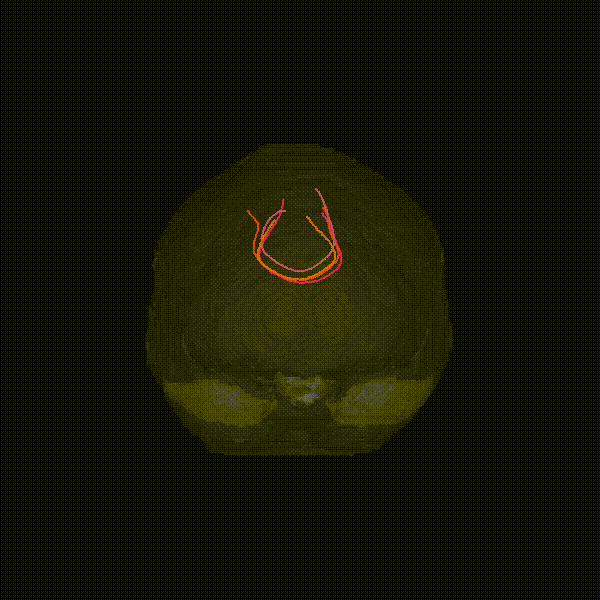

<div align="center">

# GenTract (CVPR 2026 Highlight)

[](https://cvpr.thecvf.com/)
[](https://arxiv.org/abs/2511.13183)
[](https://alecsargood.github.io/GenTract/)
[](https://www.python.org/downloads/release/python-3110/)

**GenTract: Generative Global Tractography**

</div>

<p align="center">
  
</p>

<div align="center">
  <a href="https://arxiv.org/abs/2511.13183">Paper</a> •
  <a href="https://alecsargood.github.io/GenTract/">Project Page</a> •
  <a href="#news">News</a> •
  <a href="#status">Status</a>
</div>

## News

- **April 2026**: GenTract was accepted as a **highlight** paper.
- **February 2026**: GenTract was accepted at **CVPR 2026**.

## Status

Code is now available — see the installation and end-to-end workflow below.

---

This repository contains the official training and inference implementation for **GenTract**.

### Capabilities
1. Training coefficient-wise MAISI VAE models.
2. Computing stacked latent tensors from ODF/fODF volumes.
3. Training the conditional diffusion streamline model.
4. Running inference to generate `.trk` streamlines.

---

## 🛠 Installation

This project is tested and supported on **Python 3.11**.

```bash
git clone https://github.com/alecsargood/GenTract.git
cd GenTract
python3.11 -m venv .venv
source .venv/bin/activate
pip install -U pip
pip install -e .
```

---

## 📂 Repository Structure
* **`scripts/train_vae.py`**: Train one VAE per SH coefficient.
* **`scripts/compute_latents.py`**: Compute per-subject latent stacks (`*_latents.npy`).
* **`scripts/train_diffusion.py`**: Train conditional diffusion on tract arrays + latents.
* **`scripts/infer_streamlines.py`**: Generate tractograms and save `.trk`.
* **`scripts/infer_from_dwi.py`**: End-to-end single-subject inference from raw DWI (CSD fit → latents → `.trk`).
* **`scripts/preprocess_trk_to_npy.py`**: Convert `.trk`/`.tck` to fixed-point `.npy` (`N x 128 x 3`).
* **`scripts/build_manifest.py`**: Create train/val/test manifest CSVs.
* **`configs/`**: Portable default configurations (`maisi_vae.yaml`, `diffusion.yaml`).
* **`data/examples/`**: Bounding box (`bbox.csv`), distribution (`dists.csv`), and CSV templates.
* **`docs/CONFIG_SETUP.md`**: Concrete config/path setup examples.

---

## 📊 Data Requirements & Formatting

### General Requirements
* **Grid Consistency:** All ODF/fODF images used for VAE training and latent computation must share the same grid shape and voxel spacing. If a subject is not in the VAE grid space, affine-register and regrid it first.
* **Inference Consistency:** At inference time, the ODF/fODF input used to compute latents must be affine-registered and regridded to the exact reference shape/spacing used for the VAE.
* **Normalization:** We recommend z-score normalizing fODF/ODF per channel and min-max normalizing streamlines prior to diffusion training.

### Expected Inputs
* **ODF/fODF NIfTI files (`.nii.gz`)** for VAE + latent extraction.
* **Fixed-point arrays (`.npy`)** of shape `N x 128 x 3`, generated from tractograms for diffusion training.
* **CSV Manifest** linking paths and dataset splits.

### Manifest Columns
* **Required for VAE/latent stage:** `odf_path`
* **Required for diffusion training:** `odf_path`, `tract_path`, `latent_path`, `split`
* **Optional (defaults applied if missing):** `rot`, `deg`

---

## 🚀 End-to-End Workflow

### 1. Convert tractograms to fixed-point numpy arrays
```bash
python scripts/preprocess_trk_to_npy.py \
  --input-root /path/to/tractograms \
  --output-dir /path/to/tract_numpy_128 \
  --pattern '*.trk' \
  --num-points 128 \
  --workers 8
```

### 2. Build initial manifest (ODF + tract + split)
```bash
python scripts/build_manifest.py \
  --odf-root /path/to/odf_root \
  --tract-root /path/to/tract_numpy_128 \
  --output-csv /path/to/manifest.csv \
  --tract-template 'tracts_{subject}.npy'
```

### 3. Train VAE models (one run per coefficient)
*VAE checkpoints are saved under: `results/vae_maisi-coeff_<coeff>/best_autoencoder.pth`*

```bash
for c in $(seq 0 27); do
  python scripts/train_vae.py \
    --config configs/maisi_vae.yaml \
    --coeff "$c" \
    --data-dir /path/to/odf_root \
    --bbox-csv data/examples/bbox.csv \
    --stats-csv data/examples/dists.csv
done
```

### 4. Compute latent stacks for all manifest rows
```bash
python scripts/compute_latents.py \
  --config configs/maisi_vae.yaml \
  --manifest-csv /path/to/manifest.csv \
  --output-dir /path/to/latents \
  --vae-results-dir ./results \
  --bbox-csv data/examples/bbox.csv \
  --stats-csv data/examples/dists.csv \
  --write-latent-manifest /path/to/manifest_with_latents.csv
```

### 5. Train diffusion model
*First, set `data.csv_file` in `configs/diffusion.yaml` to your `manifest_with_latents.csv`.* *Diffusion checkpoints will be saved to: `results/diff_<model_dim>_<layers>/best_model.pth`*

```bash
python scripts/train_diffusion.py --config configs/diffusion.yaml
```

### 6. Infer streamlines and write `.trk`
```bash
python scripts/infer_streamlines.py \
  --resdir ./results/diff_256_6 \
  --manifest-csv /path/to/manifest_with_latents.csv \
  --output-dir /path/to/generated_trk \
  --inf-steps 50 \
  --num-groups 16 \
  --num-generate 1024
```

### 7. (Optional) End-to-end inference from raw DWI
Runs a single subject through the full path — fit SH coefficients from `dwi + bvals + bvecs + mask` (DIPY/PyAFQ CSD), compute VAE latents, run diffusion inference, and save `.trk`.

```bash
python scripts/infer_from_dwi.py \
  --dwi /path/to/subj_dwi.nii.gz \
  --bvals /path/to/subj.bvals \
  --bvecs /path/to/subj.bvecs \
  --mask /path/to/subj_brain_mask.nii.gz \
  --resdir ./results/diff_256_6 \
  --vae-results-dir ./results \
  --vae-config configs/maisi_vae.yaml \
  --bbox-csv data/examples/bbox.csv \
  --stats-csv data/examples/dists.csv \
  --work-dir /path/to/workdir \
  --output-dir /path/to/generated_trk \
  --backend pyafq \
  --inf-steps 50 \
  --num-groups 16 \
  --num-generate 1024
```
*`--backend pyafq` requires pyAFQ installed; use `--backend dipy` to avoid that dependency.*

---

## 📝 Additional Notes
* **Inference Space:** Output `.trk` files are generated in the training fODF data space. You can use an inverse affine transform to register them back to the native subject space.
* **Weights & Biases:** `wandb` logging is optional. Set `wandb.enabled: false` in the configs to disable online logging.
* **Preprocessing Files:** Ensure `bbox.csv` and `dists.csv` match your specific data preprocessing assumptions.

---

## 📖 Citation
```bibtex
@inproceedings{sargood2026gentract,
  title     = {GenTract: Generative Global Tractography},
  author    = {Sargood, Alec and Puglisi, Lemuel and Thompson, Elinor
               and Musolesi, Mirco and Alexander, Daniel C.},
  booktitle = {Proceedings of the IEEE/CVF Conference on Computer Vision
               and Pattern Recognition (CVPR)},
  year      = {2026}
}
```
